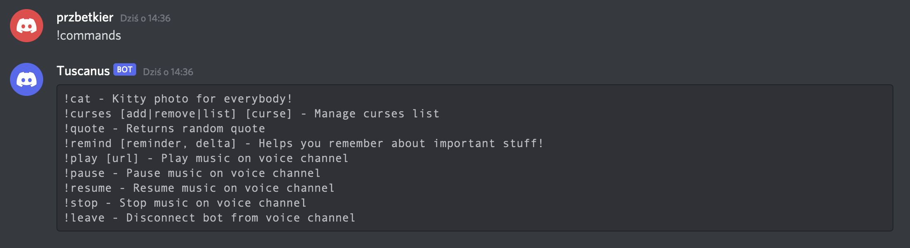
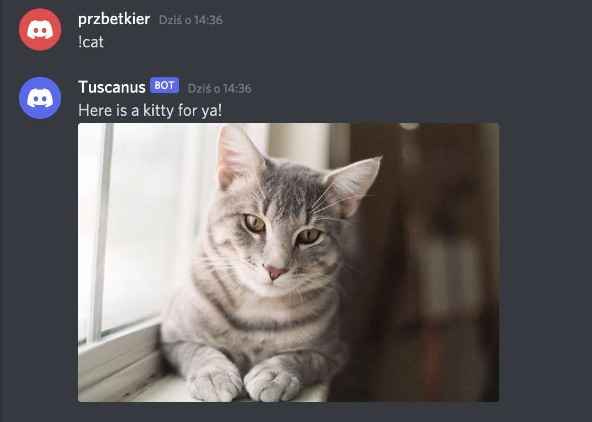
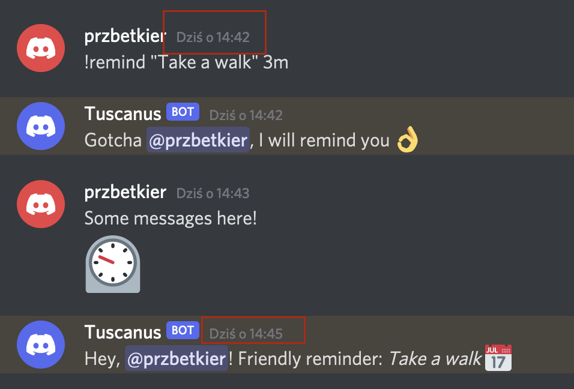
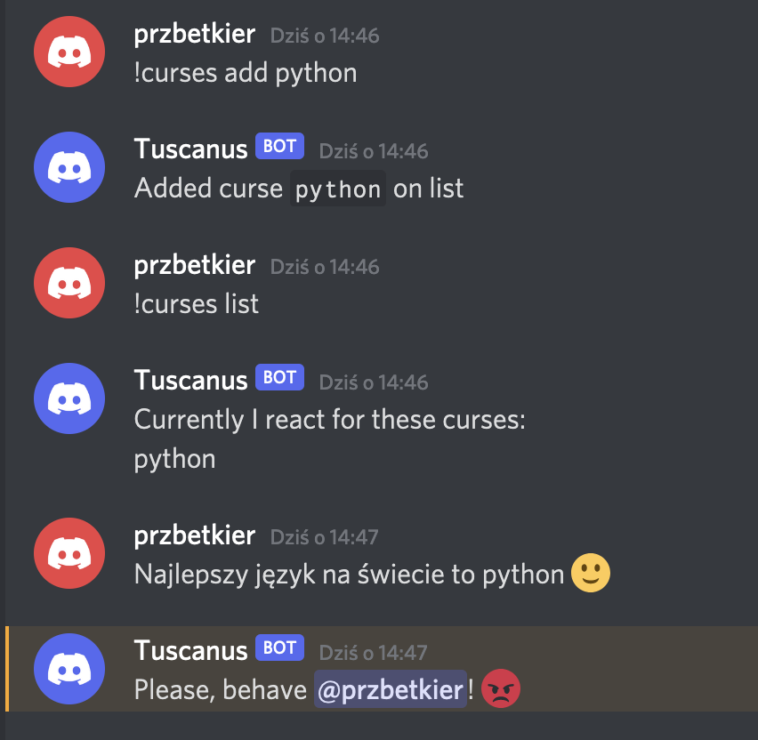
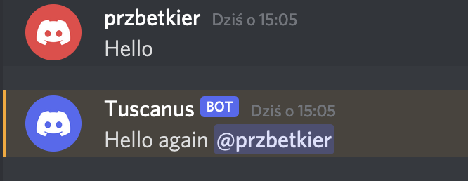

# Python discord bot

Simple [discord](https://discord.com) bot written in python.

For development set up your own discord server and [create a bot](https://discord.com/developers/applications), then obtain token and create your own .env file and put that token in:
```
AUTH_TOKEN=<your_token>
SERVER_NAME=<your_server_name>
```

## Available commands:
- !commands - lists all available bot commands
- !cat - posts random photo of a cat
- !curses - add/remove or list forbidden words. When word is used by any user the bot will react.
- !quote - posts a random quote
- !remind - bot will remind OP about anything he asks, whenever he asks
- !play/pause/stop/leave - bot will join Voice Chat and play music from given YouTube url

## Screenshots

* #### List commands
    ```
      !commands
    ```
    
    

* #### Get a random cat image
    ```
      !cat
    ```
    
    

* #### Remind yourself anything
    ```
      !remind
    ```
    
    

* #### Get a random quote
    ```
      !quote
    ```
    
    

* #### Ban curses or other words
    ```
      !curse
    ```
    
    

* #### Greet users
  Bot will greet anybody who says 'hi' or 'hello'
  